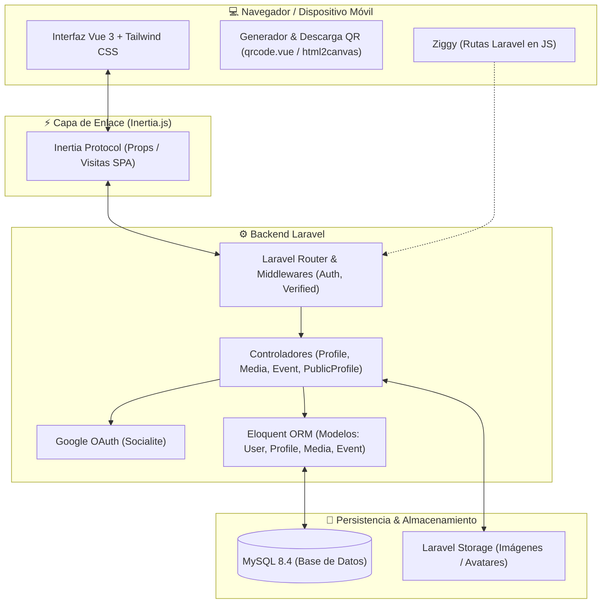
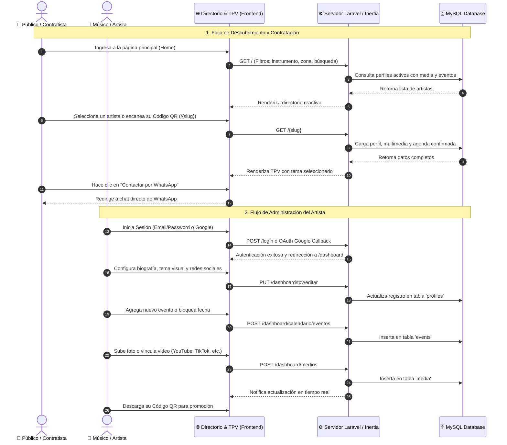
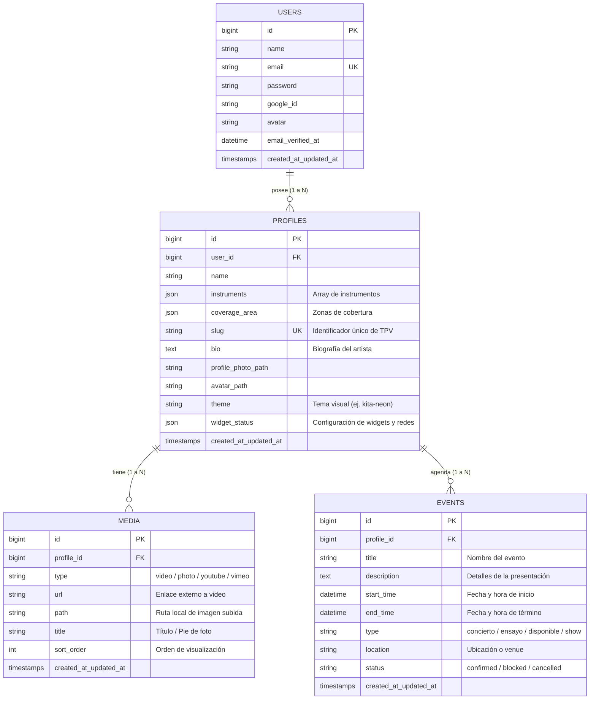

# 🎵 KITA - Plataforma & Tarjeta de Presentación Virtual (TPV) para Músicos

<p align="center">
  
</p>

<p align="center">
  <strong>Plataforma digital para la gestión de portafolios, agendas y tarjetas de presentación interactivas para artistas y agrupaciones musicales.</strong>
</p>

<p align="center">
  
  
  
  
  
  
</p>

---

## 🎯 1. Fin del Proyecto

**Kita** nace con el objetivo de revolucionar la forma en que los músicos, solistas y bandas gestionan su presencia digital y se conectan con contratistas, venues, organizadores de eventos y su público.

### Objetivos Principales
* **Tarjeta de Presentación Virtual (TPV) Interactiva:** Reemplazar las tarjetas de presentación impresas tradicionales por un perfil web dinámico (`/{slug}`), optimizado para dispositivos móviles y accesible al instante.
* **Directorio Público de Talento Musical:** Un buscador en tiempo real con filtros por instrumento, género y zona de cobertura geográfica para conectar a contratistas con artistas disponibles en su región.
* **Difusión Instantánea mediante Código QR:** Cada artista cuenta con un código QR autogenerado descargable para imprimir en pósters de conciertos, tarjetas físicas o proyectar durante shows en vivo.
* **Gestión Centralizada de Portafolio y Agenda:** Panel privado donde el músico administra sus próximas presentaciones, bloqueos de fechas, muestras de audio/video de redes sociales y galerías fotográficas.
* **Contacto Directo Sin Intermediarios:** Enlace directo de contratación vía WhatsApp y redirección a plataformas de streaming (Spotify, YouTube, etc.) y redes sociales.

---

## 🛠️ 2. Stack Tecnológico

El proyecto está construido bajo una arquitectura monolítica moderna impulsada por el stack **Laravel + Inertia.js + Vue 3**, ofreciendo la reactividad de una SPA (Single Page Application) sin la complejidad de crear y mantener una API REST separada.

### Backend
* **PHP 8.3+ / 8.5**
* **Laravel Framework:** Manejo de enrutamiento, controladores, Eloquent ORM, migraciones, seeders y middleware de autenticación.
* **Laravel Breeze & Sanctum:** Autenticación por sesión y protección de rutas privadas.
* **Laravel Socialite:** Autenticación OAuth rápida y segura mediante cuentas de Google.
* **Inertia.js (Laravel Adapter v2.0):** Puente que permite renderizar componentes Vue directamente desde controladores de Laravel pasando props reactivas.
* **Tightenco / Ziggy:** Generación y consumo de rutas nombradas de Laravel en el entorno JavaScript (`route('profile.show')`).

### Frontend
* **Vue.js 3 (Composition API & `<script setup>`):** Interfaces dinámicas, reactivas y componentes modulares.
* **Tailwind CSS & PostCSS:** Sistema de estilos utilitarios con soporte para temas oscuros, efectos de neón, gradientes y diseño responsivo.
* **Sistema de Temas Dinámicos:** Soporte para múltiples paletas visuales personalizadas por artista (*Kita Neon*, *Cyber Purple*, etc.).
* **Vite:** Herramienta de compilación ultrarrápida y servidor de desarrollo con Hot Module Replacement (HMR).
* **qrcode.vue:** Generación reactiva de códigos QR vectoriales para cada perfil.
* **html2canvas:** Exportación y descarga gráfica de tarjetas de presentación y códigos QR en formato imagen.

### Base de Datos, Almacenamiento & DevOps
* **MySQL 8.4:** Almacenamiento relacional de usuarios, perfiles, eventos y elementos multimedia.
* **Laravel Storage:** Gestión local y en la nube para subida de fotos de perfil, avatares y galerías de imágenes.
* **Laravel Sail (Docker):** Entorno de desarrollo contenerizado con servicios preconfigurados para PHP/Nginx y MySQL.

---

## 📊 3. Diagramas de Funcionamiento

### A. Arquitectura General del Sistema



---

### B. Flujo de Experiencia de Usuarios



---

### C. Diagrama Entidad - Relación (Base de Datos)



---

## 🚀 4. Instalación y Entorno de Desarrollo Local

### Requisitos Previos
* [Docker Desktop](https://www.docker.com/) instalado y en ejecución.
* [Node.js](https://nodejs.org/) (v18 o superior) y NPM.
* [Composer](https://getcomposer.org/) (opcional si se usa directamente dentro de Sail).

### Pasos de Configuración

1. **Clonar el repositorio:**
   ```bash
   git clone <URL_DEL_REPOSITORIO>
   cd Kita
   ```

2. **Configurar las variables de entorno:**
   ```bash
   cp .env.example .env
   ```

3. **Iniciar los contenedores Docker con Laravel Sail:**
   ```bash
   ./vendor/bin/sail up -d
   ```
   > *Nota:* Si tienes configurado el alias en tu shell, puedes ejecutar simplemente `sail up -d`.

4. **Instalar dependencias de PHP y generar la clave de aplicación:**
   ```bash
   sail composer install
   sail artisan key:generate
   ```

5. **Ejecutar migraciones y poblar la base de datos con datos de prueba:**
   ```bash
   sail artisan migrate:fresh --seed
   ```

6. **Crear el enlace simbólico para almacenamiento público de imágenes:**
   ```bash
   sail artisan storage:link
   ```

7. **Instalar dependencias de Node e iniciar el servidor de desarrollo Vite:**
   ```bash
   npm install
   npm run dev
   ```

8. **Acceder a la aplicación:**
   * **Directorio Principal:** [http://localhost](http://localhost)
   * **Vite HMR:** [http://localhost:5173](http://localhost:5173)

---

## 📁 5. Estructura del Proyecto

```text
Kita/
├── app/
│   ├── Http/
│   │   ├── Controllers/          # Controladores (Profile, Media, Event, PublicProfile)
│   │   ├── Middleware/           # Middlewares de seguridad e Inertia
│   │   └── Requests/             # Form Requests de validación
│   └── Models/                   # Modelos Eloquent (User, Profile, Media, Event)
├── database/
│   ├── migrations/               # Migraciones de base de datos
│   └── seeders/                  # Seeders con perfiles y músicos de ejemplo
├── resources/
│   ├── css/                      # Estilos globales y Tailwind CSS
│   └── js/
│       ├── Components/           # Componentes Vue reutilizables (Navbar, Cards, Modales)
│       ├── Layouts/              # Layouts autenticados y públicos
│       └── Pages/                # Vistas de Inertia
│           ├── Home.vue          # Directorio público de músicos
│           ├── Dashboard.vue     # Panel de control del artista
│           ├── Dashboard/        # Gestión de medios y calendario
│           └── Profile/          # TPV pública (Show.vue) y edición (ArtistEdit.vue)
├── routes/
│   ├── web.php                   # Rutas web y de TPV pública /{slug}
│   └── auth.php                  # Rutas de autenticación Breeze / Socialite
├── compose.yaml                  # Configuración de Docker Compose (Laravel Sail)
├── tailwind.config.js            # Configuración de temas y Tailwind
└── vite.config.js                # Configuración de Vite y plugins
```

---

## 📄 Licencia

Este proyecto está distribuido bajo la licencia [MIT](LICENSE).
